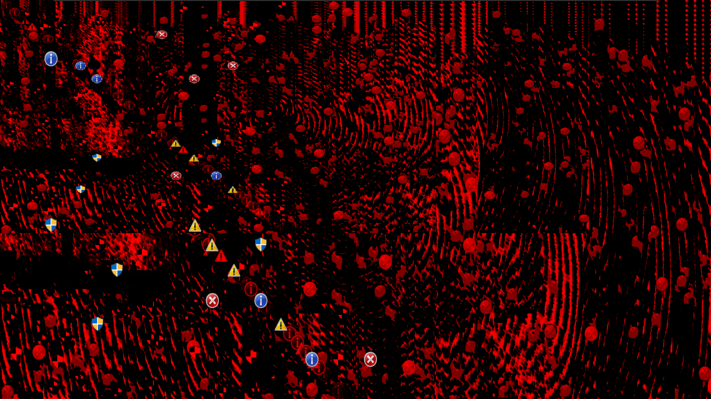
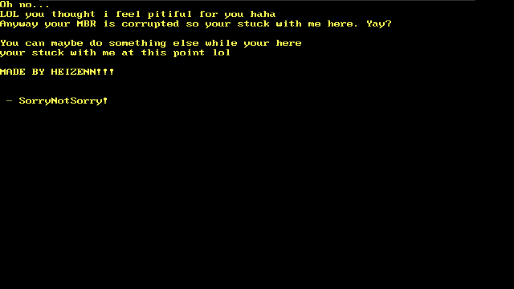

# SorryNotSorry (Trojan.Win32.SorryNotSorry!)
This is my Horror trojan called SorryNotSorry!.exe and it is a trojan with flashy stuff
and i hope you enjoy this malware if you test or review it.

- Heizenn

# Some fun facts about this trojan
1. This horror trojan was made in 1 or 2 weeks
2. it oddly looks like Clutt6.6.6

# Features
1. MBR corruption
2. File encryption via AES
3. Different payloads for supported and unsupported OS versions
4. GDI

# Compatibility
Windows 11
Windows 10 (OS tested on)
Older Windows Version that isnt Vista or older

# Pictures
* <b>Infernum part:</b> Preview of Unusable Stage

* <b>Infernum part:</b> MBR on compatible OS

* <b>Infernum part:</b> MBR on incompatible OS

# Credits

@Heizenn - Creator of Malware
